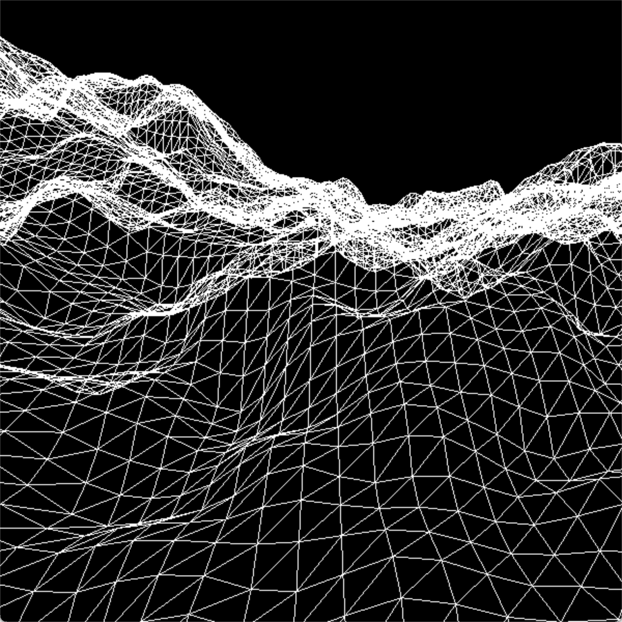

# CS 450 Final Project Report: Procedurally Generated Infinite-Scrolling 3D Terrain Simulation

This report details the design and development of my final project, a
procedurally generated infinite-scrolling 3D terrain simulation inspired by
[this demo from The Coding Train on YouTube](https://www.youtube.com/watch?v=IKB1hWWedMk).

## Video demo

See a video demo:
[https://media.oregonstate.edu/media/1_ezhu1ccz](https://media.oregonstate.edu/media/1_ezhu1ccz)

## Project overview

The scene consists of a single triangle grid. The application turns the grid
into a 3D terrain mesh by transforming each vertex's y-height according to a
deterministic 2D Perlin noise algorithm. The noise algorithm produces a height
map in real time that can be shifted across the mesh, producing an
infinite-scrolling "terrain flyover" effect. I was also able to add several
rendering/color themes to alter the final appearance of the mesh.

This section details how I addressed each implementation concern from the
proposal, and how my actual approach differed from my expected approach.

<p float="left">
    
</p>

<p float="left">
    
    
</p>

### Transformations (vertex buffer object/vertex shader)

In my proposal, I wrote that I planned to take a fixed-function OpenGL approach
for calculating vertex transformations, and potentially transition to a vertex
buffer object and shader-based implementation after I was more comfortable with
shaders after Project 6.

Ultimately, I skipped the fixed-function implementation altogether and went
straight for the vertex buffer object (VBO) and shader approach. Because the
topology of the mesh structure itself never actually changes, it made more sense
to store a single set of vertices using a VBO and perform the height
transformations for each vertex independently, in parallel, rather than doing
all 10,000-1,000,000 calculations (depending on grid size) on the CPU and
sending new coordinates to the GPU every single frame.

```cpp
// InitGraphics()

// Init shader program
Terrain.Init();

// Compile, generate error messages, download executable to GPU
Terrain.Create("terrain.vert", "terrain.geom", "terrain.frag");

// ...

// Generate VBO handle
glGenBuffers(1, &VertexBuffer);

// Send vertex VBO send data
glBindBuffer(GL_ARRAY_BUFFER, VertexBuffer);
glBufferData(GL_ARRAY_BUFFER, sizeof(VertexArray), VertexArray, GL_STATIC_DRAW);
Terrain.EnableVertexAttribArray("aVertex");
```

```cpp
// Display()

// Set vertex coordinate attribute pointer
glBindBuffer(GL_ARRAY_BUFFER, VertexBuffer);
Terrain.SetAttributePointer3fv("aVertex", 3, (GLfloat*)0);

// Draw
Terrain.Use();
glDrawArrays(GL_TRIANGLES, 0, 6 * GRID_RES_LOW * GRID_RES_LOW);
Terrain.UnUse();
```

### Noise algorithm (vertex shader)

The other component to the vertex transformations is the noise algorithm itself,
used to determine the y-height of each vertex given its x- and z-coordinates. In
my proposal, I had planned to import an existing noise function from an external
C++ library/header file, but when I decided to move my vertex transformations to
the GPU, this changed as well.

Instead, I decided to write the Perlin noise functions directly in my vertex
shader so the calculation could be performed in parallel for each grid point. I
used ChatGPT to help write the algorithm using the prompt: "Provide a
deterministic GLSL Perlin noise algorithm that takes vec2 coordinate and returns
a height value between 0 and 1."

Originally, the ChatGPT gave me an implementation that it attributed to graphics
programmer and researcher Inigo Quilez that included a permutation table-based
hashing algorithm; I was, however, unable to substantiate the veracity of this
attribution.

After some re-prompting for my particular application, I landed on this
function-based hashing algorithm which uses a well-known GLSL hash function
(commonly shared in online forums like Stack Overflow) in place of the
permutation table.

```CPP
// terrain.vert

float hash(vec2 p)
{
    // Generate pseudo-random value between 0 and 1
    return fract(sin(dot(p, vec2(127.1, 311.7))) * 43758.5453);
}

vec2 randomGradient(vec2 gridPoint)
{
    // Convert hash value to angle (in radians) along the unit circle
    float angle = hash(gridPoint) * 6.28318530718;

    // Return the x and y components of the resultant angle
    return vec2(cos(angle), sin(angle));
}

float perlin(vec2 point)
{
    // Integer part of the coordinates (the "cell" that contains this point)
    // Fractional part of the coordinates (how far into the cell the coordinates are)
    vec2 gridPoint = floor(point);
    vec2 offset = point - gridPoint;

    // Get gradients (2D vector) for each corner of the "cell"
    vec2 g00 = randomGradient(gridPoint + vec2(0.0, 0.0));
    vec2 g10 = randomGradient(gridPoint + vec2(1.0, 0.0));
    vec2 g01 = randomGradient(gridPoint + vec2(0.0, 1.0));
    vec2 g11 = randomGradient(gridPoint + vec2(1.0, 1.0));

    // Calculate dot product for coordinate and each corner (distance to each gradient)
    float d00 = dot(g00, offset - vec2(0.0, 0.0));
    float d10 = dot(g10, offset - vec2(1.0, 0.0));
    float d01 = dot(g01, offset - vec2(0.0, 1.0));
    float d11 = dot(g11, offset - vec2(1.0, 1.0));

    // Interpolate between the values (linear interpolation)
    float u = offset.x;  // X interpolation factor
    float v = offset.y;  // Y interpolation factor

    float nx0 = mix(d00, d10, u);
    float nx1 = mix(d01, d11, u);

    // Returns a value between -1 and +1
    return mix(nx0, nx1, v);  // Final interpolation between the two results
}
```

The algorithm above did produce results, however I was not happy with the low
level of variation between points on the grid. The terrain features were too
smooth, with small levels of variation between grid points. It also produced
noticeable visual creases along the "cell" lines (due to the definite
integer/fractional-part nature of Perlin noise), resulting in a grid-like
pattern at the scale I was working with.

I provided this feedback to ChatGPT, and it provided me with one more piece to
the puzzle; multi-octave noise in which several "octaves" (or "layers") of noise
are applied, one on top of the other, at a constant-decreasing "level of
influence" as more noise is applied. Essentially, the base level of noise
creates the larger, general shape of the terrain while additional octaves zoom
in on the terrain and apply smaller, textural variations across those surfaces.

```cpp
float perlinMultiOctave(vec2 point, int octaves, float persistence)
{
    float total = 0.0;
    float frequency = 1.0;  // Base frequency (larger values for more zoomed-in noise)
    float amplitude = 1.0;  // Base amplitude (larger values for more influence)

    for (int i = 0; i < octaves; i++) {
        total += perlin(point * frequency) * amplitude;  // Apply Perlin noise with frequency and amplitude
        frequency *= 2;  // Double the frequency for next octave (zoom in)
        amplitude *= persistence;  // Decrease the amplitude (less influence as octaves increase)
    }

    return total;
}
```

<p>
    
    
</p>

### Lighting (geometry shader)

The biggest challenge I faced was determining how to achieve a flat lighting
style on a solid-fill mesh. In my proposal, I noted how the inspiration video
for this project is done with a transparent, line-only mesh with no surface
lighting at all. I specifically wanted a flat-shading, low-poly visual style,
which means recalculating surface normals for each triangle as a whole every
time the program transforms the vertices.

A triangle's surface normal is the cross product of two of its edges. In order
to perform this calculation, you must have the coordinates of all three of the
triangle's vertices, and the resultant surface normal must be applied to each
vertex. Because I went with the vertex shader approach (where the noise
calculation and height transformation is done on each vertex discretely), I was
not going to be able to access the coordinates for each vertex's neighbor
post-transformation, and therefore had no way to calculate the correct surface
normal.

After several attempts with different vertex shader-based techniques (passing
neighbor coordinates via VBO, using texture coordinates instead of absolute grid
coordinates to calculate each neighboring transformation, etc.), my research
eventually led me to using a geometry shader. The geometry shader allowed me to
perform calculations per-polygon (with all three component vertices), after the
individual vertex transformations had been applied.

```cpp
// terrain.geom

vec3 p0 = vPosition[0];
vec3 p1 = vPosition[1];
vec3 p2 = vPosition[2];

// Define two edge vectors
vec3 U = p1 - p0;
vec3 V = p2 - p0;

// Set normalized cross product as surface normal (applies to all vertices)
gNormalVector = normalize(cross(U, V));
```

This ensured I was able to set the exact same surface normal vector for all
three vertices, achieving the flat-shading, low-poly visual style I was going
for.

<p float="left">
      
    
</p>

One thing that was helpful for visual debugging was using the surface normal as
my `gl_FragColor` vector (in the fragment shader) to help visualize the
direction of each triangle's surface normal and detect any inconsistencies
between vertices on each face. The XYZ coordinates of the normal vector map
directly to RGB intensities, resulting in a unique "iridescent" effect where the
colors shift as the mesh and surface normals change orientation.

<p float="left">
    
</p>

### Color (fragment shader)

Applying different rendering/color themes was not something I'd originally put
in my proposal, but the implementation was fairly straightforward, so I made a
few basic color schemes. Some of them render the triangles as just lines (like
in the inspiration video), and others render them as solid polygons.

The Normal Map (mentioned above in the Lighting section) applies the XYZ surface
normal vector in place of an RGB color vector. The multi-colored themes (Earth
and Heat Map) apply a fragment color based on the average model coordinate
height of all three vertices in each triangle.

<p float="left">
    
    
</p>

### Movement

The final implementation consideration I outlined in my proposal was a movement
system that allows the user to scroll the terrain in any direction indefinitely,
taking advantage of the infinite terrain generation.

I achieved this with a simple `KeyDown` event listener function that checks if a
directional key (WASD) is held down and if so, increments/decrements the offset
accordingly. For auto-scrolling, the Z offset is decremented automatically each
frame. The offset values are sent to the vertex shader as a `uniform` variable.

```cpp
if (CurrentScrollMode == MANUAL)
{
    if (wKeyDown) OffsetZ -= 1;
    if (aKeyDown) OffsetX -= 1;
    if (sKeyDown) OffsetZ += 1;
    if (dKeyDown) OffsetX += 1;
}
if (CurrentScrollMode == AUTO) {
    OffsetZ -= 1;
}
```

# What I learned

The key concepts I learned from this project are:

-   **Vertex buffer objects and how they are used to assemble and send vertex
    position and attribute data to the GPU.** Since there was no prior
    assignment that required using VBOs, it took some time re-reading and
    understanding the lecture notes, but eventually I was able to implement it.
    Although the final version of the project only uses vertex position data, I
    had several different attribute buffers throughout various iterations of the
    project that included things like neighbor vertex data, initial surface
    normal vector, and vertex color. Technically, the current implementation is
    also sending texture coordinates for each vertex that could be used to
    texture the grid or apply an actual texture image-based height map.
-   **Noise algorithms and their application in creating pseudo-random
    patterns.** The 2D Perlin noise implementation I am using is a common
    classic noise algorithm often used for terrain generation applications. I
    learned how basic noise works in two dimensions, how to apply it, and I am
    interested in exploring other types of 2D noise, either for terrain or other
    natural-world applications like water and waves.
-   **Geometry shaders.** While I wasn't planning on using a geometry shader at
    first, my research revealed it to be the simplest way to solve my surface
    normal recalculation problem. The ability to work on all three vertices of a
    triangle in sequence opens up a lot of possibilities for transformations,
    adding/removing vertices, and manipulating the geometry per-face, rather
    than just per-vertex. I intend to continue researching ways of approaching
    lighting problems without the geometry shader, as I would like to experiment
    with porting my application to WebGL as well (which supports only vertex and
    fragment shaders).
-   **Modern OpenGL matrix and lighting techniques.** This project presented a
    bit of a bonus learning opportunity in that it forced me to become much more
    familiar/comfortable with the modern OpenGL model-view transformation and
    lighting pipeline. Although these are concepts we covered in the first few
    weeks of class, I needed to be much more mindful about how/when I was
    transforming vertices, and which version of the vertices I was using for
    various calculations and comparisons (e.g., before/after model-to-world or
    world-to-eye transformations). For example, the multi-color rendering themes
    required me to store and compare _model_ coordinates, meaning I had to set
    those as an `out` variable before applying the model or view matrices, which
    came before calculating the lighting vectors are based on view coordinates.
    I used this project as an opportunity to experiment more with managing the
    transformation matrices using more of a modern OpenGL approach.
