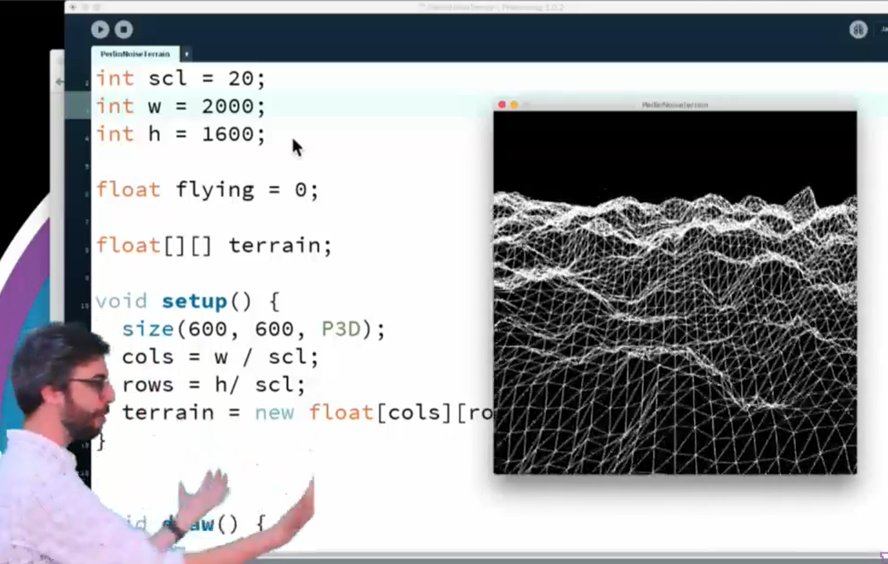

# CS 450 Final Project Proposal: Procedurally Generated Infinite-Scrolling 3D Terrain Simulation

For my final project, I would like to create a procedurally generated
infinite-scrolling 3D terrain simulation, inspired by this video demonstration
from _The Coding Train_:

    
    
<a href="https://www.youtube.com/watch?v=IKB1hWWedMk">https://www.youtube.com/watch?v=IKB1hWWedMk</a>

In the video, Daniel Shiffman (of _The Coding Train_) demonstrates how Perlin
noise (a noise algorithm invented by Ken Perlin in 1983) can be used to generate
a 2D height map which, applied to the vertices of a triangle grid, results in a
3D terrain-like mesh. Because Perlin noise is deterministic, the height map
values can be recalculated and "shifted" across the terrain mesh over time using
an offset value, resulting in a scrolling effect.

## Implementation considerations

The demo in the video is created in a program called Processing that abstracts
away many of the implementation details. Some challenges/goals I am anticipating
for an OpenGL implementation:

-   Geometry/transformations: I plan to take a standard OpenGL
    ("fixed-function") implementation approach in the research phase, but I
    would like to transition to a vertex buffer/shader implementation (after
    I've had more exposure/practice with in project 6) for calculating heights
    and transforming vertices.
-   Perlin noise algorithm: I will likely use an open-source C++ library or
    header file such as
    [https://github.com/Reputeless/PerlinNoise](https://github.com/Reputeless/PerlinNoise)
    to generate the height map data at least in the research phase, but it would
    be a fun stretch goal to implement my own simplified Perlin noise algorithm.
-   Lighting: The inspiration project is done using a transparent mesh, meaning
    there is no surface lighting. I would like to achieve a
    flat-shading/low-poly lighting style, which will require recalculating the
    surface normals each time the height map changes.
-   Movement: The inspiration project scrolls infinitely in a single direction;
    as a stretch goal, I would like to implement a movement system that allows
    the user to "fly over" (scroll) the terrain in any direction using the
    keyboard.
